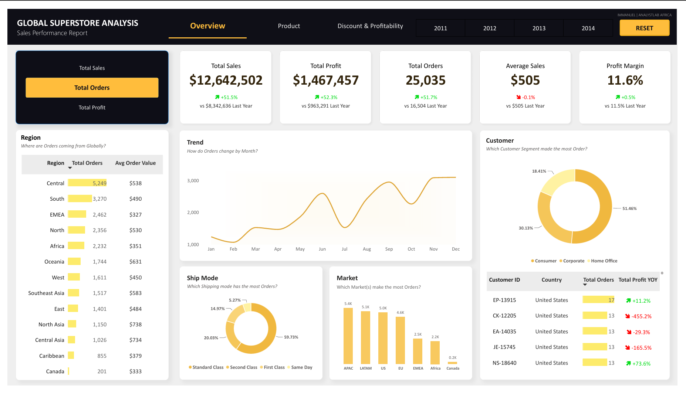
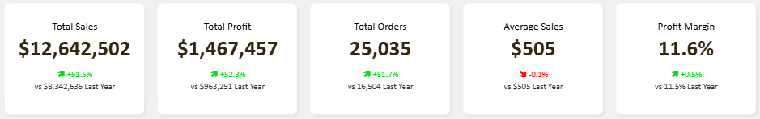
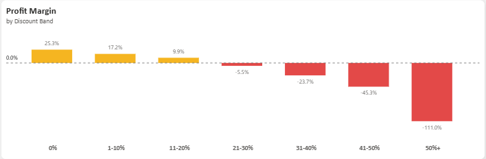
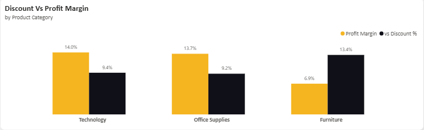
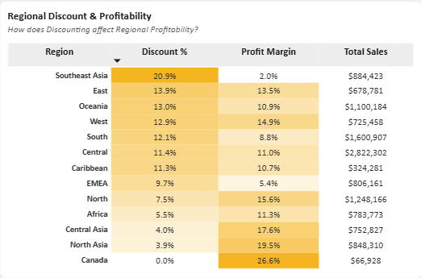
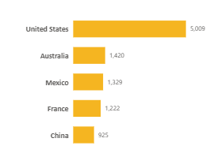

# Project Background
Global Superstore is a national retail company that serves customers across multiple regions, countries, and product categories. The company generates substantial amounts of data on its sales, profitability, customers, products, orders, discounts, and regional performance.

However, the volume of this data makes it difficult to identify the factors driving business growth and profitability. This project analyzes and synthesizes Global Superstore's business data to uncover critical insights into sales performance, customer behavior, product profitability, regional performance, and the impact of discounting, ultimately supporting more informed and data-driven business decisions.

Insights and recommendations are provided on the following key areas:

- **Sales Performance Analysis:** Evaluation of overall sales and order trends over time, with a focus on revenue growth, order volume, and average sales.
- **Product Performance:** Analysis of product categories and sub-categories to identify the strongest performers and products that contribute most to profitability.
- **Discount & Profitability Analysis:** Assessment of the relationship between discounting and profit margins to identify discount levels that enhance or erode profitability.
- **Regional Performance:** Comparison of sales, order volume, discount rates, and profit margins across regions to identify high-performing and underperforming markets.

An interactive Power BI dashboard can be downloaded [here.](https://github.com/Immanuel-19/Business-Intelligence-Dashboard-Week-2-Analystlab-Africa/raw/refs/heads/main/dashboards/Global_Sales_Performance_Report.pbix)

# Data Structure & Initial Checks

The Global Superstore dataset consists of a single table containing 24 columns and 51,290 records. The dataset was further divided into six tables during modelling using a star schema. The dataset captures information across orders, customers, geographical locations, products, sales, discounts, shipping, and profitability, providing the necessary data to evaluate the company's overall business performance.

The initial data inspection focused on understanding the dataset structure, reviewing the available fields, and assessing the quality of the data before proceeding with transformation, modelling, and dashboard development.

# Executive Summary

### Overview of Findings

Global Superstore demonstrated strong growth between 2011 and 2014, with sales increasing from $2.26M to $4.30M, representing a 90% increase, while profit grew from $249K to $504K. However, despite this substantial growth, the company's overall profit margin remained relatively flat at approximately 11-12%, indicating that increased sales volume has not translated into significant improvements in profitability

The analysis identifies several key factors affecting profitability. Excessive discounting, particularly discounts above 20%, is significantly eroding profits, while Furniture especially the Tables sub-category remains a major source of losses. Regional performance also varies considerably, with some markets generating strong sales but relatively low margins.

The following sections explore these findings in greater detail, highlighting the key performance drivers, business risks, opportunities, and actionable recommendations identified through the analysis.

Below is the overview page from the Power BI dashboard, with additional dashboard pages and visualizations included throughout the report. The complete interactive dashboard is available in the project's GitHub repository.

### Here are some key business insights:

* **Growth is strong but margin is stagnant**. Total Sales reached **$12.6M** (+51.5% YoY) and Total Profit reached **$1.47M** (+52.3% YoY), yet Profit Margin moved only from **11.5%** to **11.6%**. This shows that revenue growth is being driven largely by volume, not profitability.

  

* **Discounting above roughly 20% is actively destroying profit**. Profit margin decays from **+25.3%** at 0% discount to **-111.0%** at discounts of **50%+**, turning negative between the 11-20% and 21-30% bands. The business lost **$848,886** to discounts over 20% this year which is up 50.9% from $562,543 the prior year.

  

* **Furniture is the weakest category, and Tables is a structural loss-maker**. Furniture's margin is just 6.9%, versus 14.0% for Technology and 13.7% for Office Supplies. At the sub-category level, **Tables lost -$64,083 overall (an -8.5% margin)** despite generating $757K in sales which is the single biggest drag on profitability across the product line.

  

* **Profitability is highly uneven by region, independent of sales volume**. Southeast Asia generates **$884K in sales but only a 2.0% margin (driven by a 20.9% average discount rate)**, while Canada despite modest sales of $66,928 posts the best margin in the business at 26.6%. The Central region drives the highest total sales **($2.82M) at a healthy 11.0% margin**, making it the most reliable large market.

  

* **Consumer segment dominates order volume, and the U.S. anchors global demand**. Consumers account for 51.46% of orders versus 30.13% Corporate and 18.41% Home Office. At a country level, the United States alone generates 5,009 orders **which is more than three times** the next closest country, Australia (1,420).

  

### Management Recommendations:

* **Cap discounts at 20% company-wide**, with tiered approval required above that threshold. This directly targets the **$848,886** in profit currently lost to over-discounting, since margin turns negative beyond the 11-20% band.
 
* **Review or discontinue the Tables sub-category**. Given its **-$64,083 loss and -8.5% margin**, management should renegotiate supplier costs, reprice, or phase out underperforming Table SKUs, reallocating shelf space and catalogue focus to high-margin Technology products

* **Rebalance regional discount strategy**, especially in Southeast Asia. With a 20.9% average discount driving margin down to just 2.0%, Southeast Asia should adopt the more disciplined pricing seen in Canada and Central Asia, where lower discounting sustains 17-27% margins

* **Use seasonal order trends to drive inventory and staffing planning**. The clear **September-November** demand peak should inform proactive stock build-up and staffing ahead of Q4, minimizing stockouts in high-margin categories during the highest-order months

* **Target Home Office and Corporate segments for growth**. These segments currently trail Consumer in order volume (18.4% and 30.1% respectively) but carry comparable margins (11.5-12.0%); targeted B2B and Home Office campaigns could grow volume without the margin erosion seen from Consumer-driven discounting.
