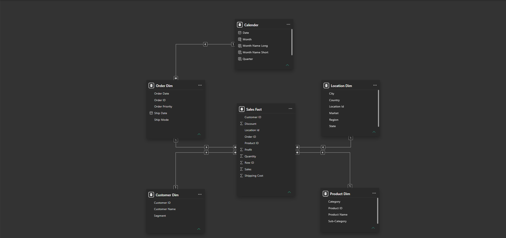

# Project Background
Global Superstore is a national retail company that serves customers across multiple regions, countries, and product categories. The company generates substantial amounts of data on its sales, profitability, customers, products, orders, discounts, and regional performance.

However, the volume of this data makes it difficult to identify the factors driving business growth and profitability. This project analyzes and synthesizes Global Superstore's business data to uncover critical insights into sales performance, customer behavior, product profitability, regional performance, and the impact of discounting, ultimately supporting more informed and data-driven business decisions.

Insights and recommendations are provided on the following key areas:

- **Sales Performance Analysis:** Evaluation of overall sales and order trends over time, with a focus on revenue growth, order volume, and average sales.
- **Product Performance:** Analysis of product categories and sub-categories to identify the strongest performers and products that contribute most to profitability.
- **Discount & Profitability Analysis:** Assessment of the relationship between discounting and profit margins to identify discount levels that enhance or erode profitability.
- **Regional Performance:** Comparison of sales, order volume, discount rates, and profit margins across regions to identify high-performing and underperforming markets.

An interactive Power BI dashboard can be downloaded [here.](https://github.com/Immanuel-19/Business-Intelligence-Dashboard-Week-2-Analystlab-Africa/raw/refs/heads/main/dashboards/Global_Sales_Performance_Report.pbix)

# Data Structure & Initial Checks

The Global Superstore dataset consists of a single table containing 24 columns and 51,290 records. The dataset captures information across orders, customers, geographical locations, products, sales, discounts, shipping, and profitability, providing the necessary data to evaluate the company's overall business performance.

The initial data inspection focused on understanding the dataset structure, reviewing the available fields, and assessing the quality of the data before proceeding with transformation, modelling, and dashboard development.

